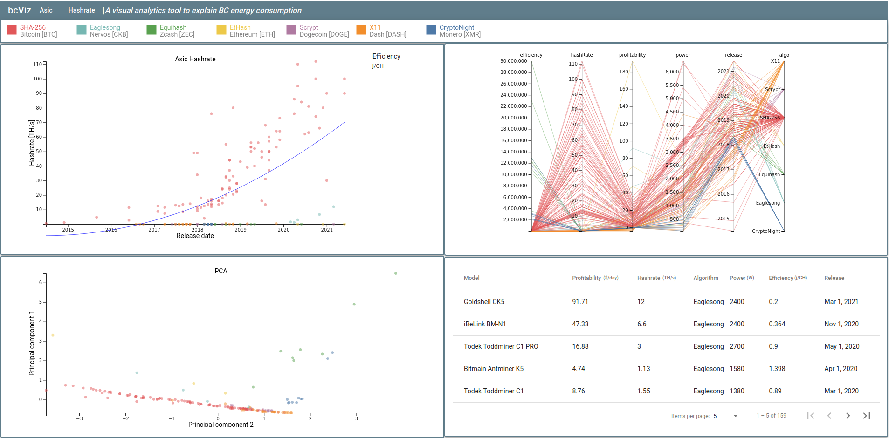
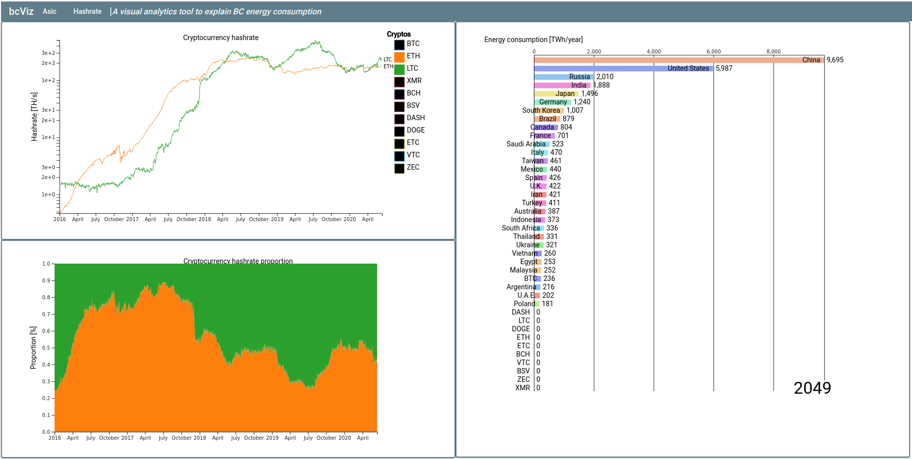

# A visual analytics tool to explain blockchain’s energy consumption
Project on Blockchain electricity consumption for the exam of Visual Analytics 20/21, Sapienza University of Rome.

This system aims to show the relations between the most important factors related to the PoW blockchains' energy consumption: network hashrate and efficiency. In the following, mainly these two aspects of different blockchains will be explored; in particular, we will try to answer to some emblematic questions: what is the trend of the networks' hashrates? How are partitioned the hashrates between the different blockchains? How are hashrate and efficiency related to energy consumption, and how much is the latter influenced by these two parameters? Are we going towards better or worse performances? Full report is avilable [here](docs/report.pdf).

The following are two screenshot of the main views of our VA system, that is fully available [here](https://blockchain-viz.web.app/asic). The former is the ASIC view:

The latter is focused on Hashrate data:

## Dataset
There was no dataset already comprehending all the data we needed in this analysis, thus we have performed some information integration. We exploited data from the following sources:

- PoW-based crypto-currency networks hashrate -> [coinmetrics.io](https://coinmetrics.io/)
- Application Specific Integrated Circuit (ASICs) -> [asicminervalue.com](https://www.asicminervalue.com/)
- countries electricity consumption -> [U.S. EIA](https://www.eia.gov/about/)

## Authors
- Francesco Colasante
- Giammarco D'Alessandro
- Simone Di Tanna
